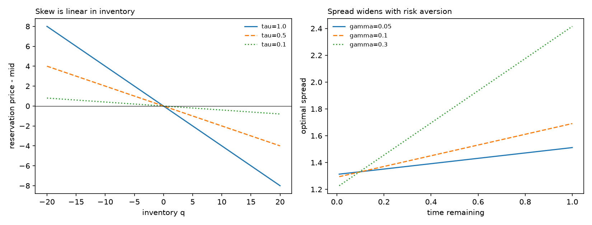
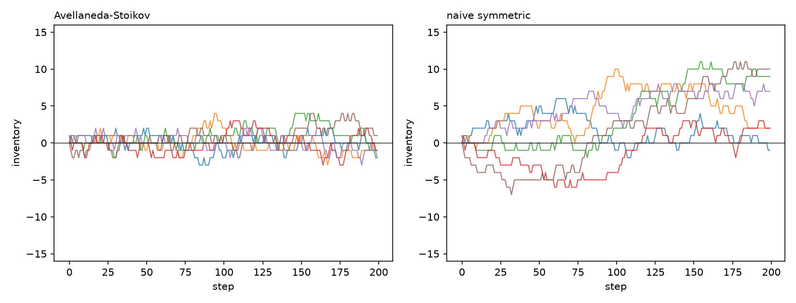
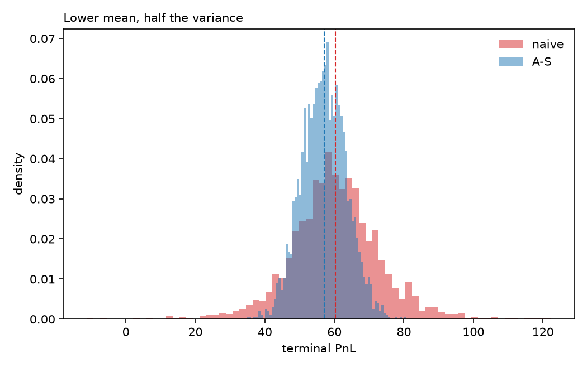
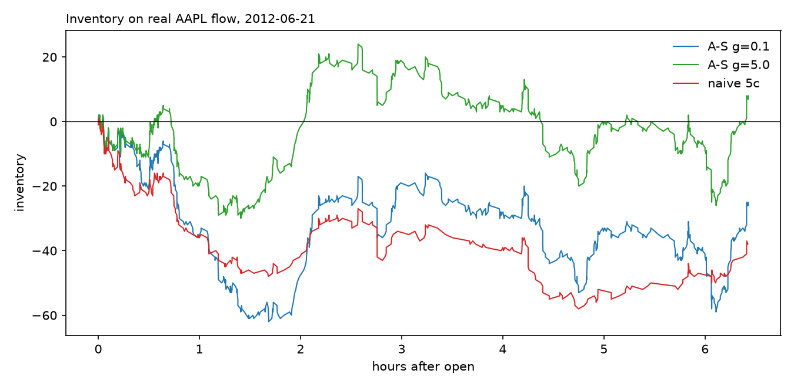
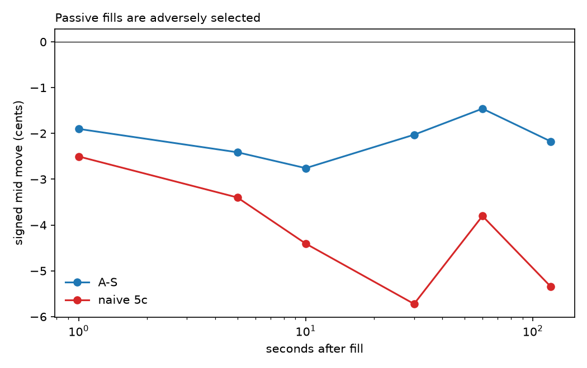

# Optimal Market Making

Derivation of the Avellaneda-Stoikov model from the HJB equation, simulation
against a naive symmetric maker, and an empirical test on Nasdaq message-level
order book data.

**Finding:** on real AAPL order flow, A-S earns comparable PnL to a naive fixed
spread while carrying roughly a third of the inventory. It is also less
adversely selected, which the model does not attempt and does not predict.

## The problem

A market maker quotes a bid and an ask. Quote tight and you fill often but earn
little per fill; quote wide and the reverse. Every fill also leaves you holding
inventory you did not choose, exposed to the mid-price wherever it goes.

## Derivation

Mid-price is Brownian, dS = sigma dW. Orders arrive as a Poisson process whose
intensity decays with quote distance, lambda(delta) = A exp(-k delta). The maker
maximises exponential utility of terminal mark-to-market wealth. The value
function satisfies an HJB equation with a diffusion term and two jump terms, one
per side of the book.

The ansatz u(s,x,q,t) = -exp(-gamma x) exp(-gamma theta(s,q,t)) makes the wealth
dimension factor out entirely, collapsing the problem to an equation in theta.
This is why exponential utility: no other choice separates.

Two results fall out. The **reservation price**

    r(s,q,t) = s - q gamma sigma^2 (T-t)

is the price at which the maker is indifferent to holding inventory q. Quotes
are centred on r, not on the mid, so long inventory shifts both quotes downward
and leans on the market to return the maker to flat. Inventory skewing is
derived, not imposed. The **optimal spread**

    delta_a + delta_b = gamma sigma^2 (T-t) + (2/gamma) ln(1 + gamma/k)

has an inventory-risk term that vanishes at expiry and an order-arrival term
that does not.

## Simulation

2,000 sessions against a naive maker quoting a fixed 0.85 half-spread:

| | mean PnL | sd | 5th pct | mean max abs(q) |
|---|---|---|---|---|
| A-S | 57.05 | 6.38 | 46.85 | 4.0 |
| naive | 60.39 | 12.60 | 41.18 | 9.0 |

A-S gives up 5% of the mean and halves the standard deviation, roughly doubling
the Sharpe ratio. The 5th percentile improves despite the lower mean.

## Empirical test

LOBSTER reconstruction of Nasdaq TotalView-ITCH, AAPL, 2012-06-21, 10 levels.
400,391 events, 23,658 visible executions, mean spread 15.3 cents on a stock
trading 577-588.

The arrival intensity parameter k is calibrated from the data rather than
assumed. Fitting lambda = A exp(-k delta) to the distribution of trade distances
from the mid gives **k = 34.2**, against a textbook placeholder of 1.5. The
exponential form holds well: 7,501 trades within 1.2 cents of the mid decaying
to 2 trades at 28.7 cents.

Quoting continuously against real flow, filling when an incoming order crosses:

| strategy | PnL | final inventory | fills |
|---|---|---|---|
| A-S gamma=0.1 | 411.57 | -26 | 798 |
| A-S gamma=1.0 | 272.81 | -10 | 782 |
| A-S gamma=5.0 | 80.61 | +7 | 811 |
| naive 5c | 416.21 | -38 | 392 |
| naive 8c | 278.98 | -32 | 100 |

At gamma=1.0, A-S earns 272.81 holding -10 against naive 8c earning 278.98
holding -32: the same money on a third of the position.

## Where the model breaks

A-S assumes order arrivals are independent of price direction. Nobody trading
against the maker knows anything. Measuring the signed mid-price move after each
fill shows otherwise:

| strategy | 1s | 10s | 60s |
|---|---|---|---|
| A-S gamma=0.1 | -1.90c | -2.76c | -1.46c |
| naive 5c | -2.50c | -4.41c | -3.80c |

Every markout is negative: passive fills systematically precede the price moving
against the maker. At a roughly 6 cent half-spread, adverse selection at the 10
second horizon consumes close to half the theoretical edge.

Markouts are worst at 10 seconds and partially recover by 60, the signature of
temporary impact decaying and leaving a permanent information component.

A-S is meaningfully less adversely selected than the naive maker despite not
modelling adverse selection at all. Skewing appears to proxy for it: a maker
that is already long has lowered its bid, so it stops catching a falling knife.

## Limitations

- A single trading day in 2012. Market structure has changed. The contribution
  is methodological.
- Fills assume the maker is at the front of the queue whenever its quote is
  crossed, which overstates fill rates.
- No latency, no exchange fees or rebates, no position limits.
- Sigma is estimated once for the whole session and held constant.
- The model is the original A-S formulation with no inventory penalty at
  terminal time and no informed-trader component.
